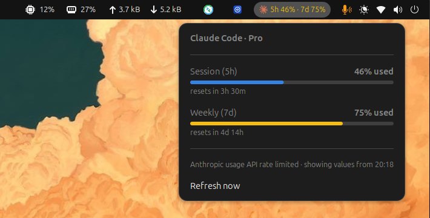

# Claude Code Usage

Shows your Claude Code 5-hour and weekly usage in the GNOME top panel.



## Install

```sh
git clone https://github.com/pyaf/gnome-claude-code-extension.git
cd gnome-claude-code-extension
./install.sh
gnome-extensions enable claude-code-usage@rishabh
```

Restart the shell if it does not appear (X11: `Alt`+`F2`, type `r`, Enter).

Unofficial. Uses an undocumented Anthropic endpoint and needs Claude Code
logged in. MIT. The Claude logo is Anthropic's trademark, used only to identify
the service.
